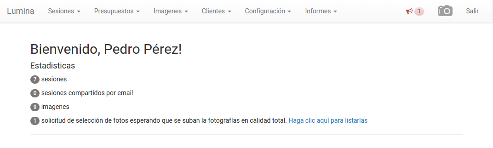

Introducción
============

El presente manual provee la información necesaria para apoyar al usuario en el uso del sistema,
su estructura y funcionamiento.

Lumina es un sistema web, por lo tanto su uso se realiza a través de su navegador. Esto posee innumerables
beneficios, por ejemplo:

* es más seguro, porque no requiere instalar programas en su computadora local
* accesible desde cualquier equipo
* multiplataforma: Linux, MacOS, Windows, Android, etc.
* siempre disponible.

Página inicial
--------------

Así se ve la página inicial del sistema:

