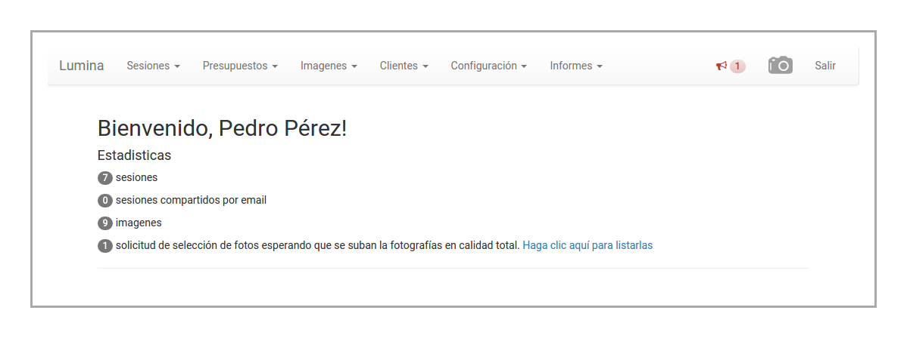

Introducción
============

El presente manual provee la información necesaria para apoyar al usuario en el uso del sistema,
su estructura y funcionamiento.

Lumina es un sistema web, por lo tanto su uso se realiza a través de su navegador. Esto posee innumerables
beneficios, por ejemplo:

* es más seguro, porque no requiere instalar programas en su computadora local
* accesible desde cualquier equipo
* multiplataforma: Linux, MacOS, Windows, Android, etc.
* siempre disponible.

Destinatarios
-------------

El presente manual está destinado a fotógrafos y clientes.

Las secciones destinadas a fotógrafos están identificadas de la siguiente manera:

.. image:: images/rol-photo.png
   :scale: 50%

Las secciones destinadas a los clientes están identificadas de la siguiente manera:

.. image:: images/rol-customer.png
   :scale: 50%

Página inicial
--------------

Así se ve la página inicial del sistema:

Tutorial
--------

Para más información, y referencia sobre cómo realizar las tareas más comunes, por favor
acceda a la sección de **Tutorial**.
