Selección y entrega de fotografías
==================================

El proceso de selección y entrega de fotografías posee 5 pasos fundamentales,
ilustrados en el siguiente gráfico, que inclue el paso en cuestión, y el tipo
de usuario que realiza el paso (fotógrafo o cliente):

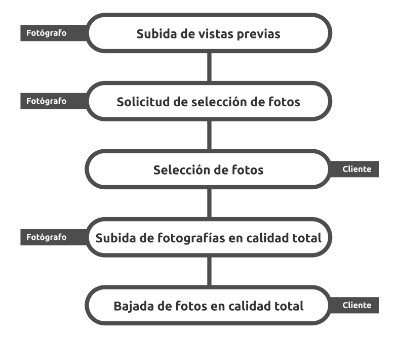

Subida de vistas previas
------------------------

.. topic:: Vistazo general

   El primer paso debe realizarlo el fotógrafo, y consiste en subir las vistas previas
   de las fotografías.

   .. image:: images/workflow-photo-selection-01.png
      :scale: 50%
      :align: center

Desde la página de visualización de sesiones fotográficas se puede seleccionar
la opción para la subida de fotografías.

El proceso comienza cuando se selecciona la opción "Agregar vistas previas". Seleccionando esta opción,
el sistema optimiza el proceso de subida de las fotografías, ya que crea las vistas previas en el
equipo del cliente.

.. image:: images-border/session-upload-photo-01-session-details.png
   :scale: 90%
   :align: center

Ahora el sistema guiará al fotógrafo paso por paso. Lo primero que el fotógrafo debe
hacer es seleccionar el tamaño de las previsualizaciones:

.. image:: images-border/session-upload-photo-02-preview-size.png
   :scale: 90%
   :align: center

Una vez que se haya elegido el tamaño de previsualización, el sistema requiere que se seleccionen
las fotografías que se desean agregar a la sesión fotográfica:

.. image:: images-border/session-upload-photo-03-choose-files.png
   :scale: 90%
   :align: center

Al seleccionar "Choose files" (dicho texto depende del sistema operativo y del navegador, por
lo que puede variar), aparecerá una ventana de diálogo, donde el fotógrafo debe seleccionar
las fotografías a incluir a la sesión fotográfica.

Luego de seleccionar las fotografías, debe aceptar la selección, presionando "Open" dicho
texto también depende del sistema operativo y del navegador, por lo que puede variar).

.. image:: images-border/session-upload-photo-04-choose-files-dialog.png
   :scale: 90%
   :align: center

Automáticamente, el sistema comienza a crear las vistas previas. Para mantener al fotógrafo
informado, el sistema mostrará el progreso de la siguiente manera:

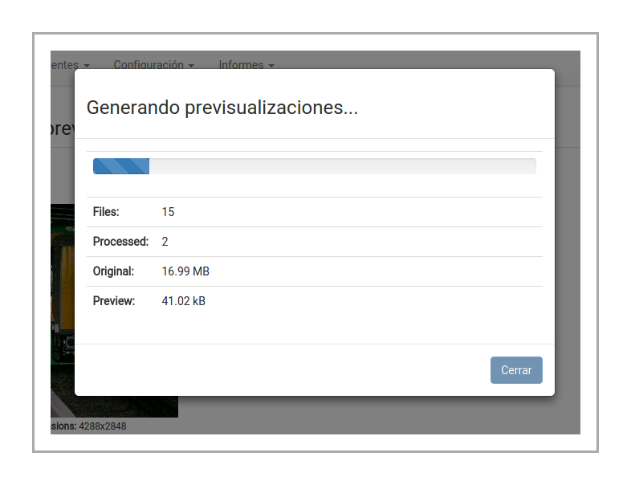

Al finalizar el proceso de generación de vistas previas, se verá la barra de progreso al 100%,
y el fotógrafo podrá cerrar el diálogo presionando "Cerrar".

.. image:: images-border/session-upload-photo-06-uploading-progress-done.png
   :scale: 90%
   :align: center

Ahora el navegador cuenta con todas las vistas previas generadas. Para subirlas al servidor e
incluirlas en la sesión fotográfica, sólo hace falta selecionar "Subir imágenes":

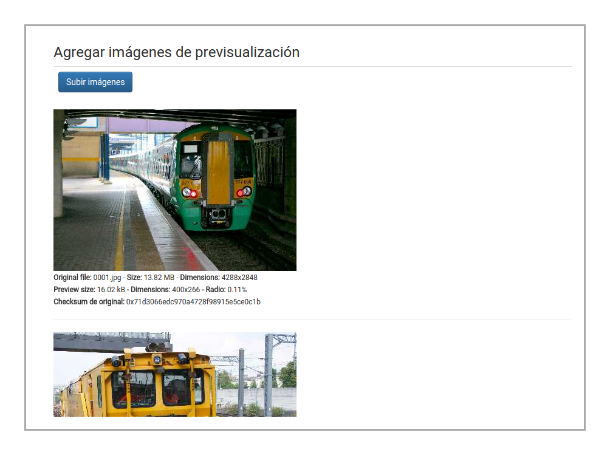

Mientras las previsualizaciones de las fotografías son subidas, el fotógrafo verá
un diálogo mostrandole el progreso.

.. image:: images-border/session-upload-photo-08-uploading.png
   :scale: 90%
   :align: center

Al finalizar, el sistema le mostrará los detalles de la sesión fotográfica, incluyendo
todas las vistas previas de las fotografías subidas.

.. image:: images-border/session-upload-photo-09-session-details-including-images.png
   :scale: 90%
   :align: center

Solicitud de selección de fotos
-------------------------------

.. topic:: Vistazo general

   El segundo paso también debe realizarlo el fotógrafo, y consiste crear una solicitud, para
   que el cliente pueda seleccionar las fotos que más le gustan, desde las vistas previas
   subidas en el primer paso.

   .. image:: images/workflow-photo-selection-02.png
      :scale: 50%
      :align: center

Desde la página de visualización de sesiones fotográficas se listan las solicitudes
creadas, y también el botón para crear una nuevas solicitudes.

Para crear una nueva solicitud, se debe seleccionar la opción "Solicitar selección de
imágenes desde presupuesto":

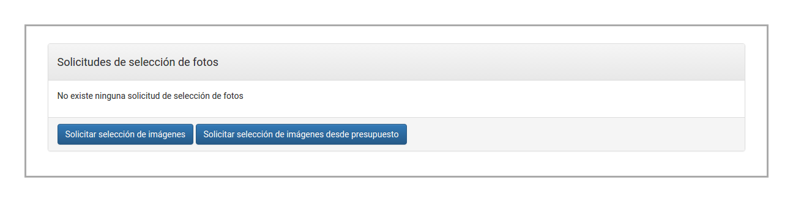

El sistema le mostrará el formulario para crear la solicitud de selección
de fotografías, con los datos del presupuesto precargados. El fotógrafo sólo
necesita seleccionar el tamaño máximo de las previsualizaciones, y seleccionar
"Solicitar":

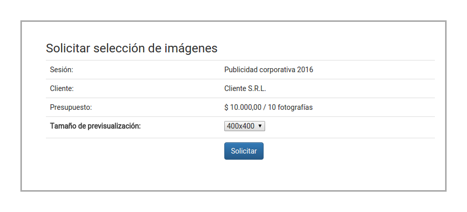

El sistema creará la solicitud, y le mostrará el mensaje de éxito:

.. image:: images-border/session-photo-selection-request-03-success.png
   :scale: 90%
   :align: center

y más abajo, en la misma página, se podrá ver la solicitud recién creada:

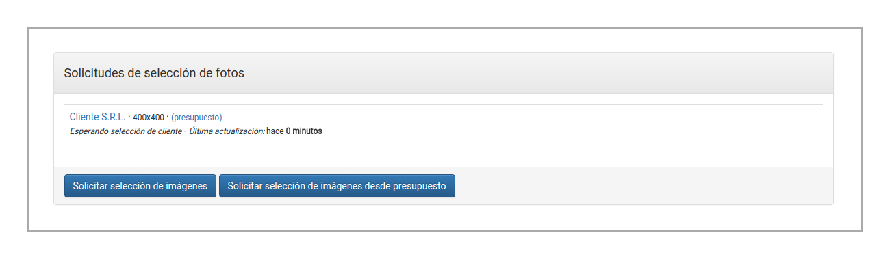

Selección de fotos
------------------

.. topic:: Vistazo general

   El tercer paso debe ser realizado por el cliente. En este paso, el sistema le
   muestra al cliente las vistas previas de todas las fotografías disponibles,
   y el cliente podrá seleccionar las fotografías que más le guste, teniendo
   como máximo la cantidad especificada en el presupuesto.

   .. image:: images/workflow-photo-selection-03.png
      :scale: 50%
      :align: center

El cliente verá una notificación en la parte superior de la página (esto se verá
en cualquier página dentro de todo el sistema). Al hacer clic en el ícono de notificaciones,
el sistema mostrará el siguiente mensaje:

.. image:: images-border/session-photo-selection-request-05-customer-notification.png
   :scale: 90%
   :align: center

Luego de hacer clic en el mensaje, el sistema mostrará la lista
de solicitudes de selección de imagenes:

.. image:: images-border/session-photo-selection-request-06-customer-list-pending.png
   :scale: 90%
   :align: center

El sistema le mostrará al cliente los datos de la sesión fotográfica, y las
previsualizaciones, con la marca de agua y en el tamaño seleccionado por el fotógrafo:

.. image:: images-border/session-photo-selection-request-07-customer-select-photos-top.png
   :scale: 90%
   :align: center

El cliente podrá seleccionar las fotografías que quiere obtener, y
luego hacer clic en "Seleccionar":

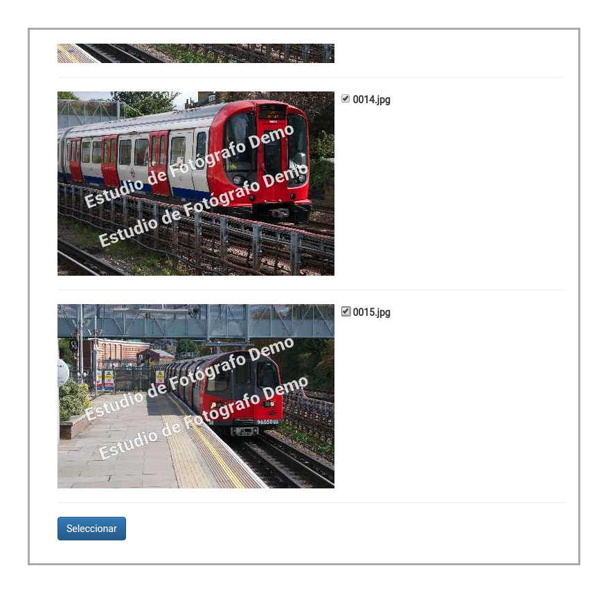

El sistema registrará las fotografías que el cliente ha seleccionado, y como resultado
mostrará el mensaje de éxito. Además, el sistema le indicará al cliente que
todavía no podrá bajar las fotografías en calidad total.

.. image:: images-border/session-photo-selection-request-09-customer-selection-done.png
   :scale: 90%
   :align: center

Subida de fotografías en calidad total
--------------------------------------

.. topic:: Vistazo general

   El cuarto paso debe ser realizado por el fotógrafo. En este paso, el fotógrafo
   sube al sistema las fotografías en calidad total.

   .. image:: images-border/workflow-photo-selection-04.png
      :scale: 50%
      :align: center

El fotógrafo verá una notificación en la parte superior de la página (esto se verá
en cualquier página dentro de todo el sistema). Al hacer clic en el ícono de notificaciones,
el sistema mostrará el siguiente mensaje:

.. image:: images-border/session-photo-selection-request-10-photographer-notification.png
   :scale: 90%
   :align: center

Luego de hacer clic en el mensaje, el sistema mostrará la lista
de solicitudes de selección de imagenes. Estas solicitudes corresponden a solicitudes
que han sido completadas por el cliente, lo que implica que el cliente está
esperando que el fotógrafo suba las fotografías en calidad total. El fotógrafo
debe seleccionar "Sesión: Publicidad corporativa 2016" (el nombre de la sesión variará):

.. image:: images-border/session-photo-selection-request-11-photographer-pending-list.png
   :scale: 90%
   :align: center

El sistema mostrará las fotografías que el cliente ha seleccionado:

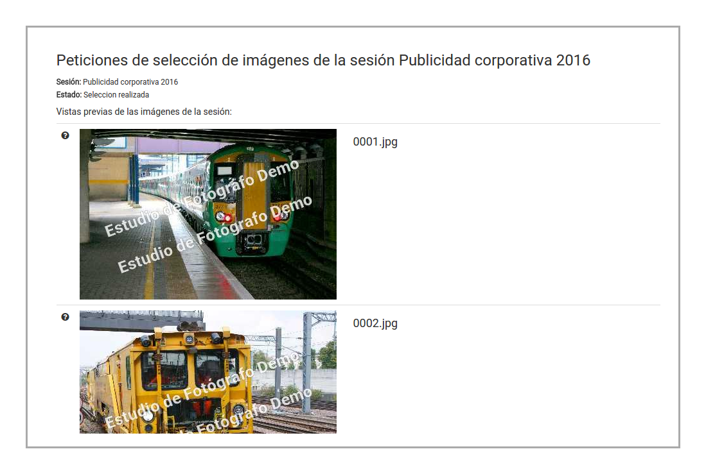

En la parte inferior de la página, el sistema mostrará el componente para seleccionar
las fotografías en calidad total. Para seleccionar los archivos, hace falta
seleccionar la opción "Choose Files":

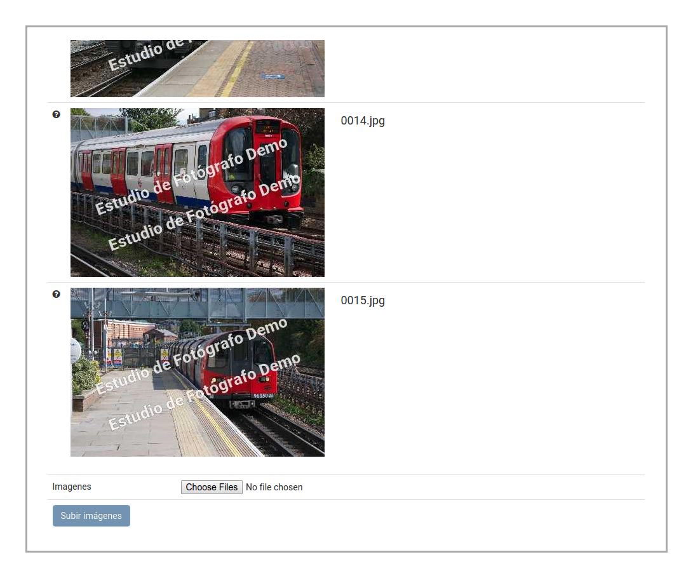

El navegador permitirá seleccionar las fotografías. En este caso, lo recomendable es
seleccionar todas las fotografías en calidad total (aún aquelas que no han sido seleccionadas
por el cliente, ya que el sistema, automáticamente filtrará las fotografías que no han
sido elegidas por el cliente):

.. image:: images-border/session-photo-selection-request-14-photographer-pending-select-files.png
   :scale: 90%
   :align: center

Luego de confirmar la selección, el sistema hará el filtrado antes mencionado. Como este
proceso puede requerir mucho tiempo, el sistema mostrará el progreso:

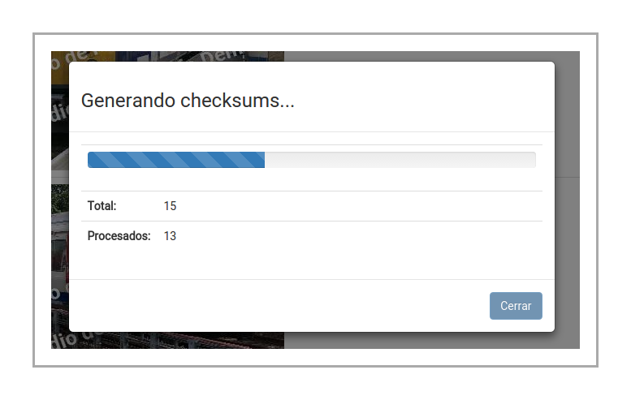

Al finalizar, el fotógrafo podrá seleccionar la opción "Cerrar":

.. image:: images-border/session-photo-selection-request-16-photographer-calculate-checksum-done.png
   :scale: 90%
   :align: center

Ahora el fotógrafo podrá seleccionar la opción "Subir imágenes" para subir las fotografías
en calidad total:

.. image:: images-border/session-photo-selection-request-17-photographer-ready-to-upload.png
   :scale: 90%
   :align: center

El sistema comenzará la subida de las fotografías en calidad total, y mostrará
al fotógrafo el progreso:

.. image:: images-border/session-photo-selection-request-18-photographer-uploading.png
   :scale: 90%
   :align: center

Al finalizar la subida de las fotografías en calidad total, se habilitará
el botón "Cerrar":

.. image:: images-border/session-photo-selection-request-19-photographer-upload-done.png
   :scale: 90%
   :align: center

El sistema mostrará un mensaje, informando que las fotografías
fueron subidas exitosamente.

.. image:: images-border/session-photo-selection-request-20-photographer-upload-done-success.png
   :scale: 90%
   :align: center

Bajada de fotos en calidad total
--------------------------------

.. topic:: Vistazo general

   Ahora el cliente ya tiene disponible las fotografías en calidad total
   para ser bajadas a su equipo.

   .. image:: images-border/workflow-photo-selection-05.png
      :scale: 50%
      :align: center

Ahora que el sistema cuenta con las fotografías en su versión de calidad total, el
cliente verá la opción "Bajar".

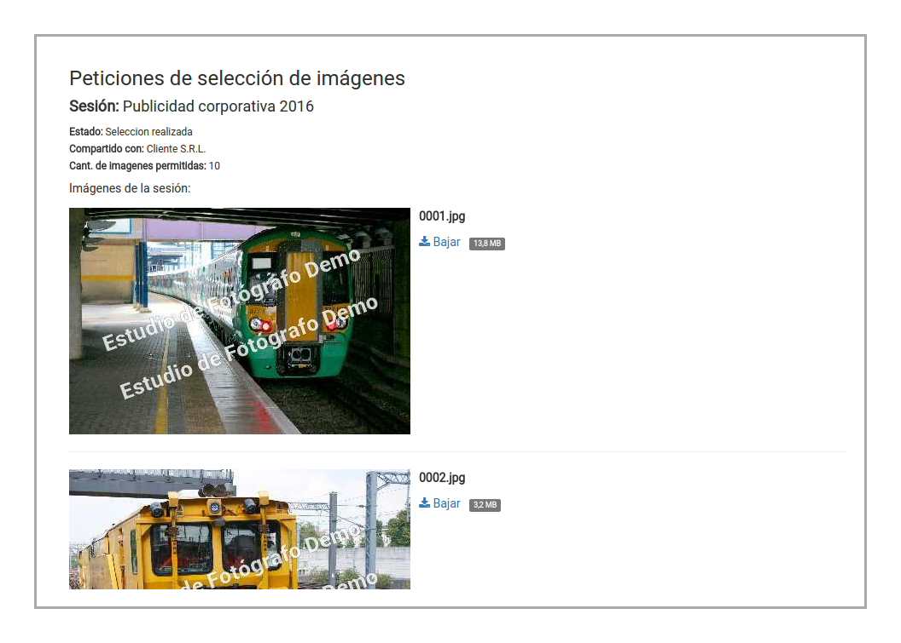

Utilizando esta opción, el cliente podrá bajar las fotografías en calidad total.
