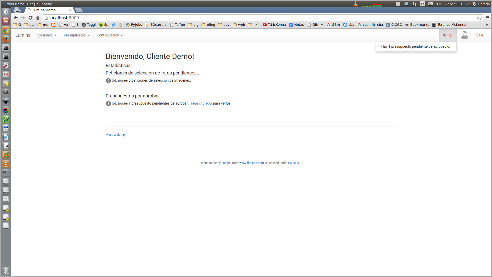
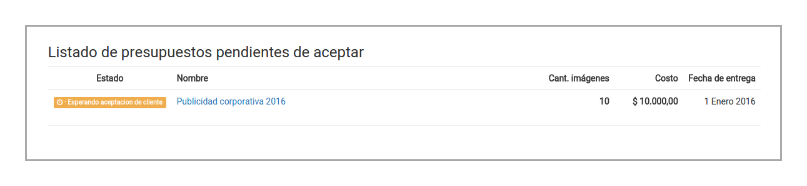
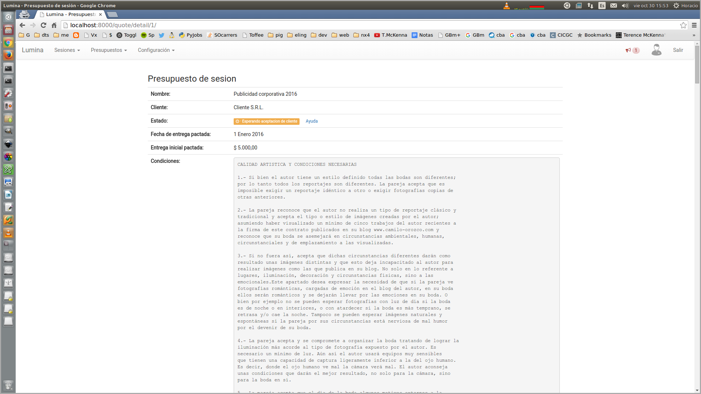
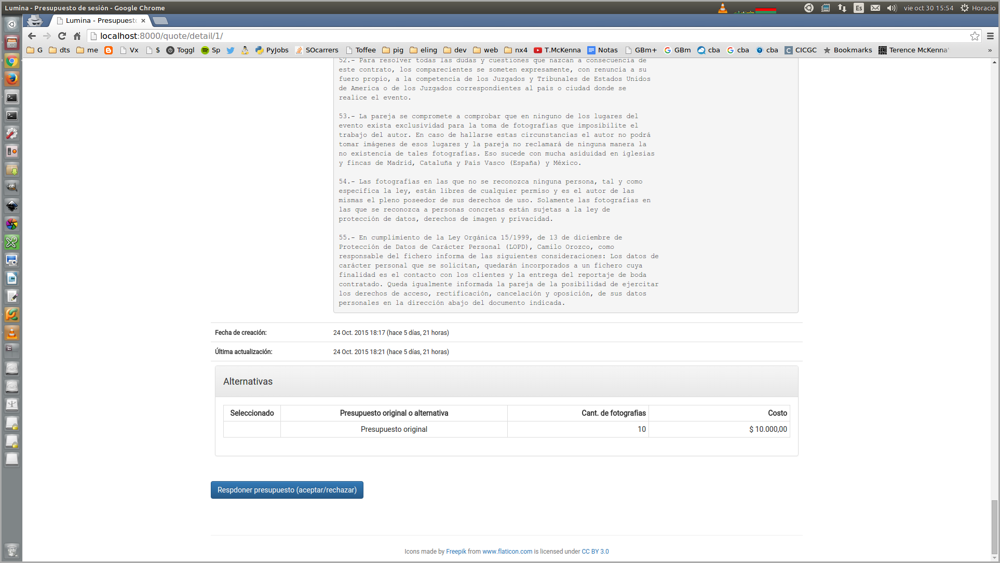
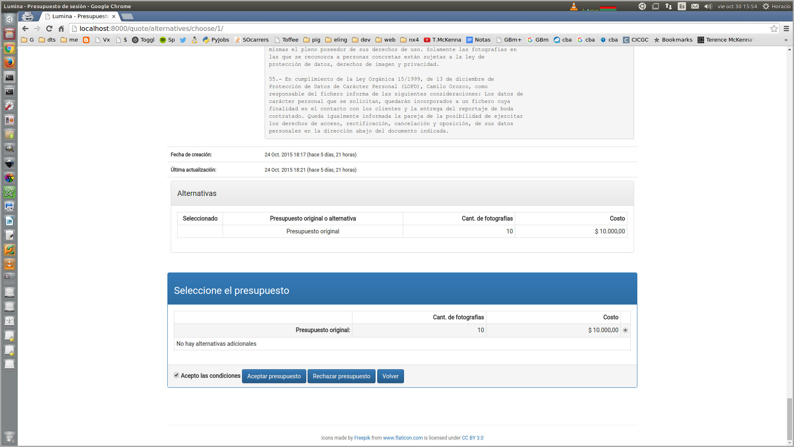
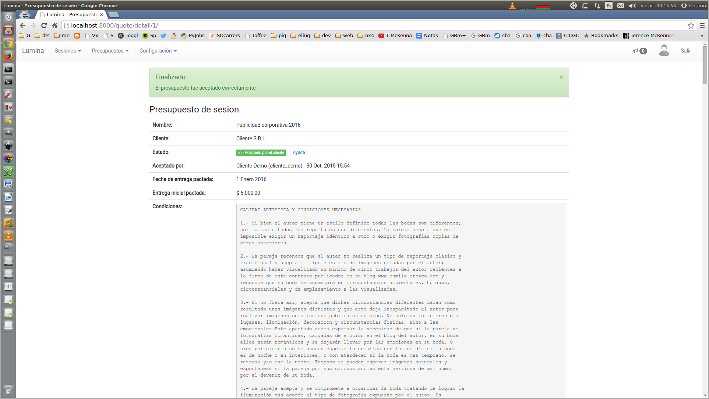

Presupuestación
===============

Creación de presupuestos (fotógrafo)
------------------------------------

.. image:: images/rol-photo.png
   :scale: 50%

Al acceder a la página de creación de presupuestos, el sistema mostrará el siguiente formulario:

.. image:: images-border/quote-create.png
   :scale: 90%
   :align: center

Para poder crear un nuevo presupuesto deberá cargar todos los datos obligatorios. Una vez que
haya cargado los datos, podrá crear el presupuesto seleccionando **Crear**:

.. image:: images-border/quote-create-with-data.png
   :scale: 90%
   :align: center

El sistema creará el presupuesto, y lo mostrará junto al mensaje de éxito:

.. image:: images-border/quote-create-with-data-done.png
   :scale: 90%
   :align: center

Accediendo a la parte inferior de la página, se pueden ver las acciones disponibles. Una vez que el
fotógrafo esté conforme con los términos del presupuesto, debe seleccionar **Confirmar presupuesto**:

.. image:: images-border/quote-create-with-data-done-bottom.png
   :scale: 90%
   :align: center

El sistema registrará el cambio en el presupuesto:

.. image:: images-border/quote-create-waiting-customer-accept.png
   :scale: 90%
   :align: center

Ahora el fotógrafo debe esperar a que el cliente acepte el presupuesto.

Aceptación o rechazo del presupuesto (cliente)
----------------------------------------------

El sistema le muestra al cliente una notificación cuando hay un presupuesto pendiente de aceptar.

Al seleccionar dicha notificación, el sistema le muetra al cliente los presupuestos pendientes de aceptar.

Al hacer clic en el presupuesto, el sistema muestra los detalles de dicho presupuesto, incluyendo condiciones
de contratación, términos, etc.

En la parte inferior de la página, el sistema muestra el botón que le permite al usuario aceptar o rechazar
el presupuesto.

Luego de presionar el botón, el sistema muestra las opciones disponibles.

Para **rechazar** el presupuesto, el cliente simplemente debe seleccionar el botón **Rechazar presupuesto**.

Para **aceptar** el presupuesto, el cliente debe seleccionar la cantidad de fotografías que desea,
debe hacer clic en **Acepto las condiciones**, y finalmente seleccionar el botón **Aceptar presupuesto**.

Como respuesta a la aceptación del presupuesto, el sistema muestra el mensaje de éxito, y el
detalle del presupuesto aceptado.

