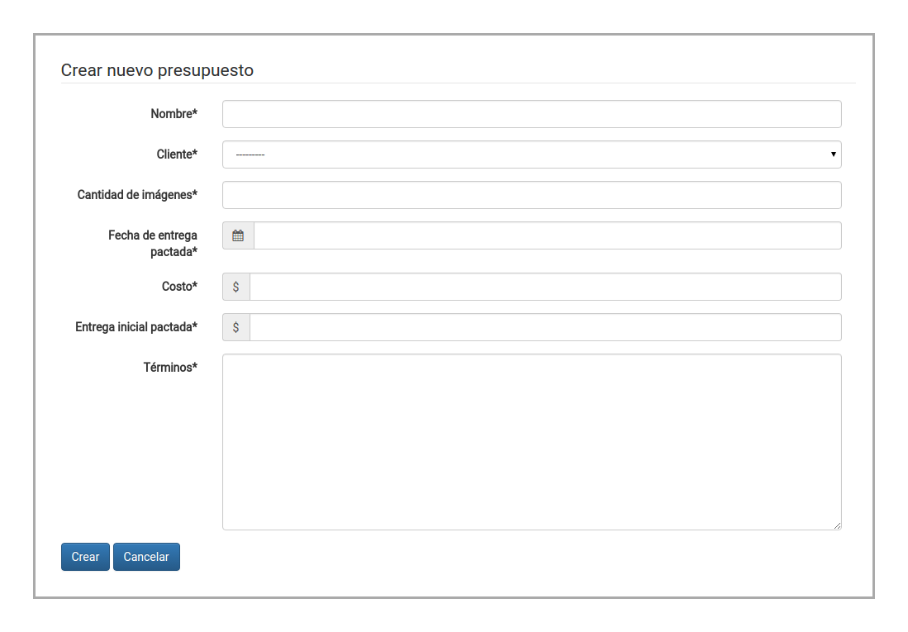
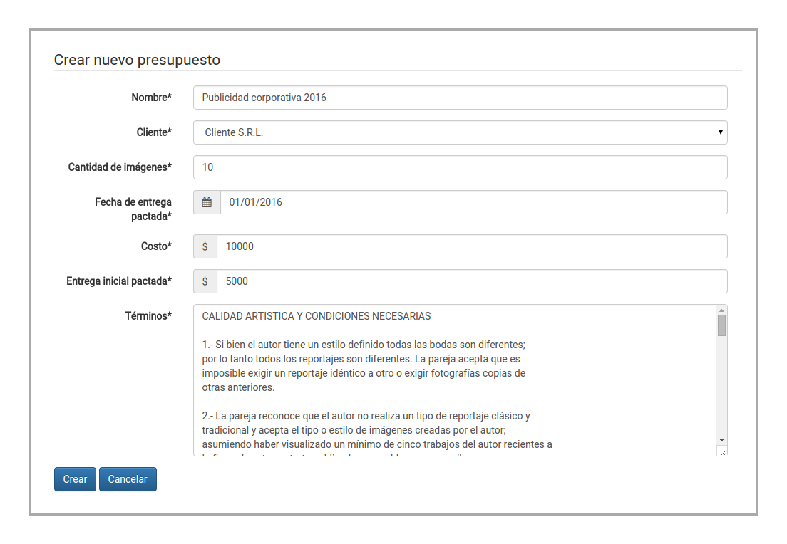
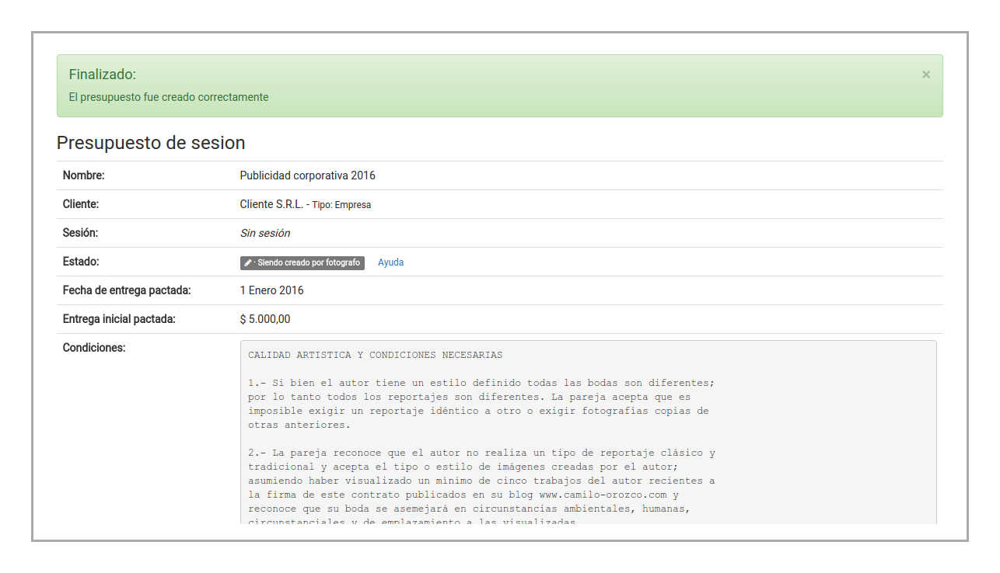
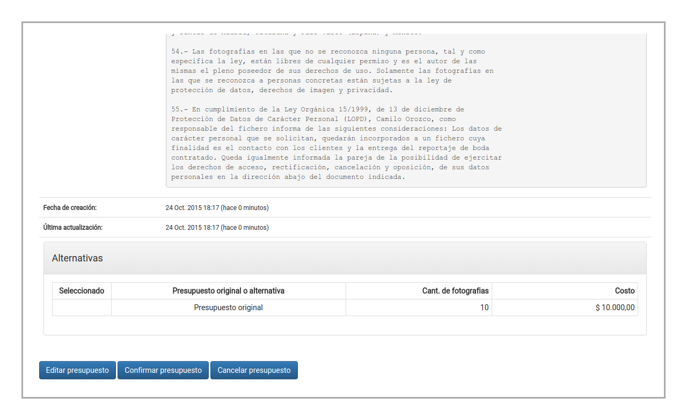
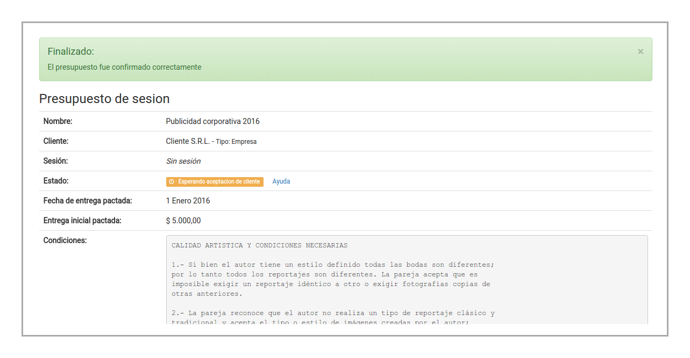

Creación de presupuestos
========================

.. image:: images/rol-photo.png
   :scale: 50%

Al acceder a la página de creación de presupuestos, el sistema mostrará el siguiente formulario:

Para poder crear un nuevo presupuesto deberá cargar todos los datos obligatorios. Una vez que
haya cargado los datos, podrá crear el presupuesto seleccionando **Crear**:

El sistema creará el presupuesto, y lo mostrará junto al mensaje de éxito:

Accediendo a la parte inferior de la página, se pueden ver las acciones disponibles. Una vez que el
fotógrafo esté conforme con los términos del presupuesto, debe seleccionar **Confirmar presupuesto**:

El sistema registrará el cambio en el presupuesto:

Ahora el fotógrafo debe esperar a que el cliente acepte el presupuesto.
