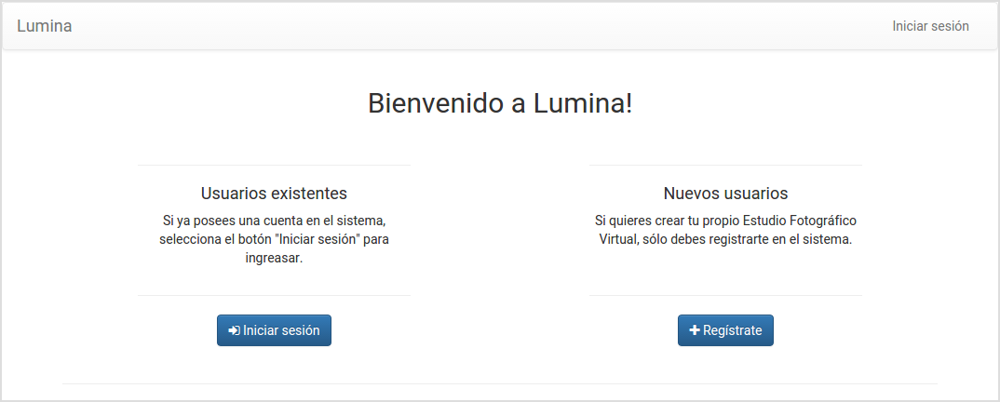
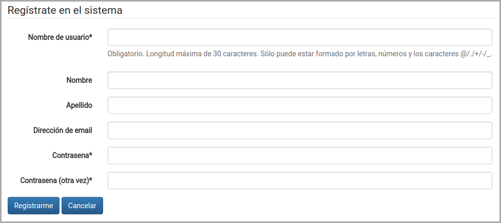
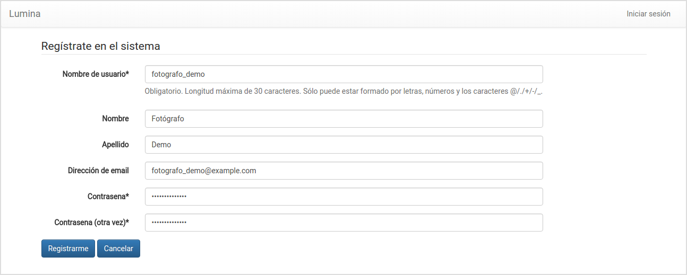
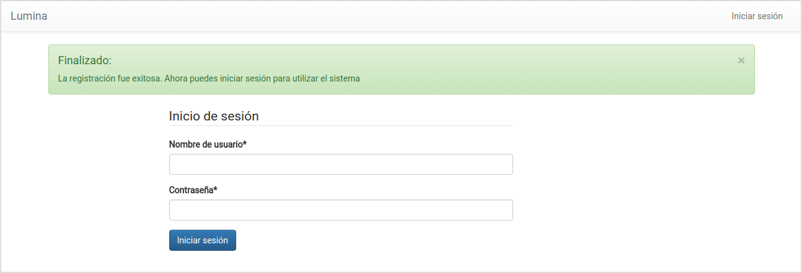

Creación del estudio fotográfico
================================

.. image:: images/rol-photo.png
   :scale: 50%

Al acceder por primera vez al sistema, tendrá la opción de iniciar sesión (si ya posee un usuario),
o crear su estudio fotográfico virtual.

Para crear su estudio fotográfico virtual, debe seleccionar **Regístrate**:

El sistema le solicitará los siguientes datos:

Una vez especificados, deberá presionar **Registrarme**:

Si los datos ingresados son válidos, el sistema le informará que el estudio fotográfico virtual
fue creado exitosamente:

