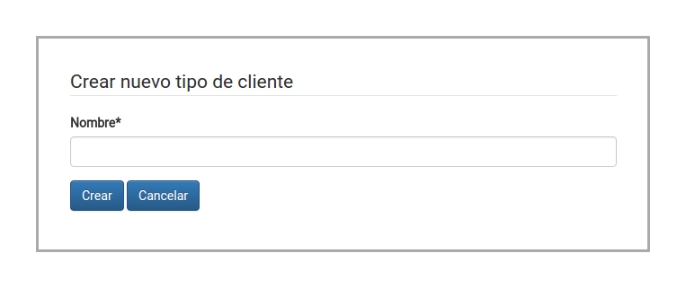
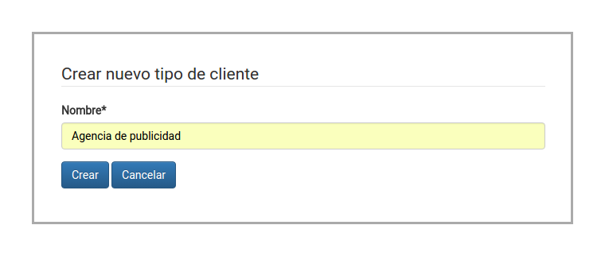
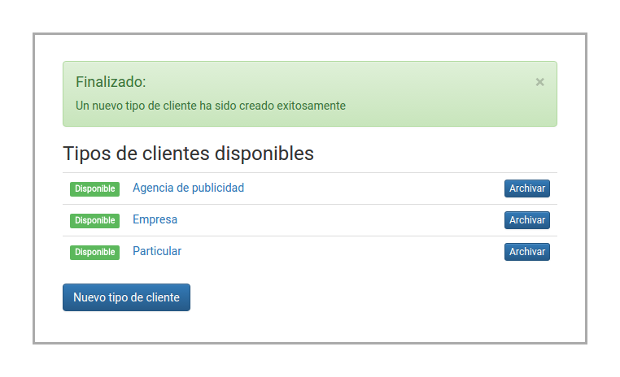

Parametrización del sistema
===========================

Para el correcto funcionamiento del sistema, es requerido que se carguen ciertos
parámetros básicos, ya que éstos son requeridos en otras secciones del sistema.

Estas opciones están disponibles en el menú "Configuración":

.. image:: images-border/system-parametrization-01-menu.png
   :scale: 90%
   :align: center

Tipos de parámetros
-------------------

El sistema cuenta con 3 tipos de parámetros a cargar.

**Tipos de clientes**

Necesarios para clasificar los clientes en distintos tipos. Por ejemplo:

* agencia de publicidad
* empresa

**Tipos de sesiones fotográficas**

Necesarios para clasificar las sesiones fotográficas. Por ejemplo:

* publicitaria
* catálogo
* evento

**Tamaños de previsualización**

Necesarios para determinar qué tamaños se utilizarán para generar las previsualizaciones
de las fotografías. Por ejemplo:

* 400x400
* 800x800

Creación de tipo de cliente (fotógrafo)
---------------------------------------

.. image:: images/rol-photo.png
   :scale: 50%

xxxxxxxxxxxxxxxxxxx

.. image:: images-border/system-parametrization-02-customer-type-list.png
   :scale: 90%
   :align: center

xxxxxxxxxxxxxxxxxxx

xxxxxxxxxxxxxxxxxxx

xxxxxxxxxxxxxxxxxxx

xxxxxxxxxxxxxxxxxxx
